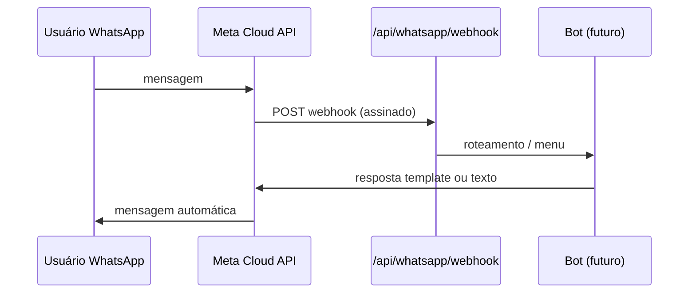

# Plano — Chatbot WhatsApp (IPECC)

**Status:** Fase 1 (motor + simulador) e **Fase 2** (webhook + assinatura + dry-run Cloud API) em código. Sandbox Meta pendente.

## Diagnóstico (layout público)

| Item | Detalhe |
|------|---------|
| Onde | `app/layout.tsx` — topbar `.social` (tarja azul superior) |
| Tipo | `<a>` + SVG `.icon-social` (mesmo padrão Instagram, Facebook, etc.) |
| Antes | `https://wa.me/5511943312119?text=menu` hardcoded |
| Legado | `components/PublicLayout.tsx` — **não** usado pelo App Router atual |
| Outros | `app/eventos/page.tsx` e `app/page.tsx` — WhatsApp **por evento** (campo `eventos.whatsapp` no Supabase), não é o botão do menu |

## Configuração do número (site)

Em `.env.local` (não commitar):

```env
NEXT_PUBLIC_WHATSAPP_NUMBER=5511943312119
```

Formato: apenas dígitos, com DDI 55. Fallback único em `lib/whatsapp/publicWhatsApp.ts` se a variável estiver vazia.

Mensagem padrão ao clicar no ícone do menu:

> Olá, vim pelo site do IPECC e gostaria de atendimento.

Helper: `buildWhatsAppUrl()` em `@/lib/whatsapp`.

## Arquitetura alvo (chatbot real — não conectar ainda)



### Opções de provedor (decisão da equipe)

1. **WhatsApp Business Cloud API** (Meta) — recomendado para bot programático.
2. Provedor BSP compatível (Twilio, 360dialog, etc.) — mesmo modelo webhook + token servidor.

**Não** colocar no frontend: `WHATSAPP_ACCESS_TOKEN`, `WHATSAPP_APP_SECRET`, `WHATSAPP_VERIFY_TOKEN`.

### Variáveis servidor (futuro)

| Variável | Uso |
|----------|-----|
| `WHATSAPP_VERIFY_TOKEN` | Handshake GET do webhook |
| `WHATSAPP_APP_SECRET` | Validar assinatura `X-Hub-Signature-256` |
| `WHATSAPP_ACCESS_TOKEN` | Enviar mensagens via Graph API |
| `WHATSAPP_PHONE_NUMBER_ID` | ID do número Business |

### Rota

- `GET/POST` `app/api/whatsapp/webhook/route.ts` — esqueleto já criado (503 POST sem secrets).

### Fluxo automático inicial (fase 2)

1. **Saudação:** “Olá! Você está no atendimento do IPECC.”
2. **Menu (botões ou lista):**
   - Projetos → link `/projetos` ou texto resumo
   - Editais → `/editais`
   - Propostas → `/propostas`
   - Transparência → `/transparencia`
   - Fale com a equipe → marcar conversa para humano / notificar e-mail
3. **Handoff humano:** após opção 5 ou palavra-chave “atendente”, parar respostas automáticas por X horas.

### Estrutura de código sugerida (próximos PRs)

```
lib/whatsapp/
  publicWhatsApp.ts      # wa.me (feito)
  types.ts               # feito (Fase 1)
  botMenu.ts             # feito
  messageTemplates.ts    # feito
  botEngine.ts           # feito
  textUtils.ts           # feito
  simulator.ts           # feito
  parseWebhook.ts        # feito
  verifySignature.ts     # feito
  cloudApiClient.ts      # Fase 2
app/api/whatsapp/
  webhook/route.ts       # esqueleto (feito)
```

## Validação local (etapa atual)

```bash
npx tsc --noEmit
npm run validar:whatsapp-bot
npm run validar:whatsapp-fase2
npm run whatsapp:simulate -- reset oi 1
```

Persistência Supabase (opcional): aplicar `docs/sql/whatsapp-conversations-staging.sql` e `WHATSAPP_PERSIST_SUPABASE=1`.

Webhook local (com tunnel + secrets): `GET/POST /api/whatsapp/webhook`

1. Abrir `http://localhost:3000`
2. Clicar ícone WhatsApp na topbar
3. Confirmar abertura wa.me com texto pré-preenchido

## Próximos passos (ordem)

1. [ ] Conta Meta Business + número de teste (sandbox)
2. [ ] Preencher env servidor e testar `GET` verify no webhook
3. [ ] Implementar `verifySignature` + menu de respostas
4. [ ] Logs em `admin_logs` ou tabela `whatsapp_conversas` (opcional)
5. [ ] Go-live número real — **somente** após autorização explícita (sem deploy automático)

## Regras

- Sem deploy / produção até checklist `PROD-PREP-CHECKLIST.md`.
- Sem contratar BSP automaticamente.
- Número real de produção só com RLS e secrets no host.
